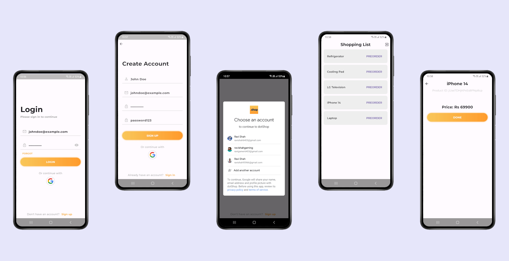

# Assignment 4 - dotShop
dotShop is a simple item display and preorder app built with Flutter and Firebase.

## Screenshots

## Features

### Login
Login using email and password.

### Sign Up
Create new account using email and password.

### Sign in with Google
Sign in to the app using Google authentication.

### Item List
List of all items available fetched from Firestore database.

### Details Page
Details of selected item.

### Forgot Password
Reset password using email.

## Known Issues
Performance can be improved.

## References
Logo for the app from [PNGWing](https://www.pngwing.com/en/free-png-nuldz). 
Design inspired from [DeepDesigns](https://www.epicpxls.com/items/ios-mobile-app-login-signup).

# -By Ravi Shah